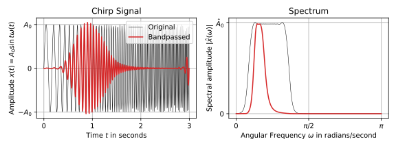

# 1. Basic signal processing with Python

Made by Alexandre Fournier (fournier@ipgp.fr), modified by Léonard Seydoux (seydoux@ipgp.fr) in 2023 for the course _Scientific Computing for Geophysical Problems_ at the [institut de physique du globe de Paris

## Goals

This Jupyter Notebook provides examples of basic signal processing with Python. It covers topics such as generating synthetic time series, computing Fourier transforms, and applying filters to signals. The examples use the `numpy`, `scipy`, and `matplotlib` libraries. The notebook is organized into cells, each containing a block of code that can be executed independently. If a module is already imported in a cell, it can be used in other cells as well. For the same reason, if a variable is defined in a cell, it can be used in other cells as well. We should not repeat the same import or variable definition in multiple cells, unless we want to overwrite the previous definition.

## Material

The notebook named [signal_processing.ipynb](signal_processing.ipynb)
presents the different concepts and examples with exercices to be completed. The solution to this notebook is provided in the notebook named [signal_processing_solution.ipynb](signal_processing_solution.ipynb). It comes with two datasets located under the `data` folder:

- [`data/chambon_la_foret.dat`](data/chambon_la_foret.dat), which contains 78 years of geomagnetic measurements at Chambon-la-Forêt, France.
- [`data/sunspot_number.dat`](data/sunspot_number.dat), which contains the monthly sunspot number from 1749 to 2016.

## Notebook contents

1. [Introduction](#1.-Introduction)
    1. [Goals](#1.1.-Goals)
    2. [Importing modules](#1.2.-Importing-modules)
2. [Synthetic data](#2.-Synthetic-data)
    1. [Synthetic monochromatic data](#2.1.-Synthetic-monochromatic-data)
    2. [Synthetic multi-component signal](#2.2.-Synthetic-multi-component-signal)
    3. [Spectral analysis](#2.3.-Spectral-analysis)
    4. [Filtering](#2.4.-Filtering)
3. [Real data analysis](#3.-Real-data-analysis)
    1. [Loading the data](#3.1.-Loading-the-data)
    2. [Spectral analysis](#3.2.-Spectral-analysis)
    3. [Filtering](#3.3.-Filtering)
    4. [Correlating with the sunspot number](#3.4.-Correlating-with-the-sunspot-number) 